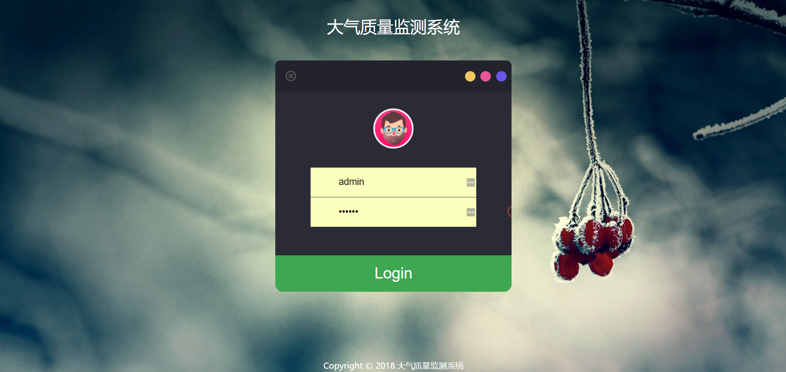

# Air Webapp

> WEB数据展示网站，基于Servlet+Jdbc搭建，进行监测数据的展示。

## 技术栈

Jsp + Servlet + Jdbc + Mysql 

> 默认 登录账号:admin 登录密码:123456

## 数据获取(物联网设备)

通过 物联网设备 / 数据模拟服务 采集数据，通过WIFI模块发送TCP数据包到TCP_SERVER，解码数据包并将数据通过HTTP发送到数据交互后台BACK服务，进行数据存储。

Webapp通过Jdbc访问MySQL数据库，将数据实时展示到WEB网站。

项目详见：[https://github.com/kevinten10/Air]

## 使用

```txt
# 1. 下载项目到本地
# git clone https://github.com/kevinten10/Air-Webapp.git

# 2. 打开项目(推荐使用IDEA)

# 3. 修改MySQL配置信息
# src\main\java\com\ten\air\constant\MysqlConfig.java

# 4. 配置Tomcat，启动项目
```

## 服务器部署

> 已将打包好的war文件放在目录下：air.war

1. 打包成war(通过IDEA打包)，修改war名为air（通过/air访问项目）

2. 上传到服务器Tomcat/webapps目录下

3. 启动Tomcat

### 异常处理

若启动后遇到404错误，可能是jstl导入问题，将pom.xml中的三个jstl相关包注释掉，刷新，然后再取消注释，刷新。即可。

### 注意事项

数据实体AirRecord字段应与Protocol中实体AirRecord字段对应，若Protocol.AirRecord发生修改，应同步修改Web.AirRecord。

## DEMO

#### 登录界面



#### 数据展示界面（默认最近二十条）

