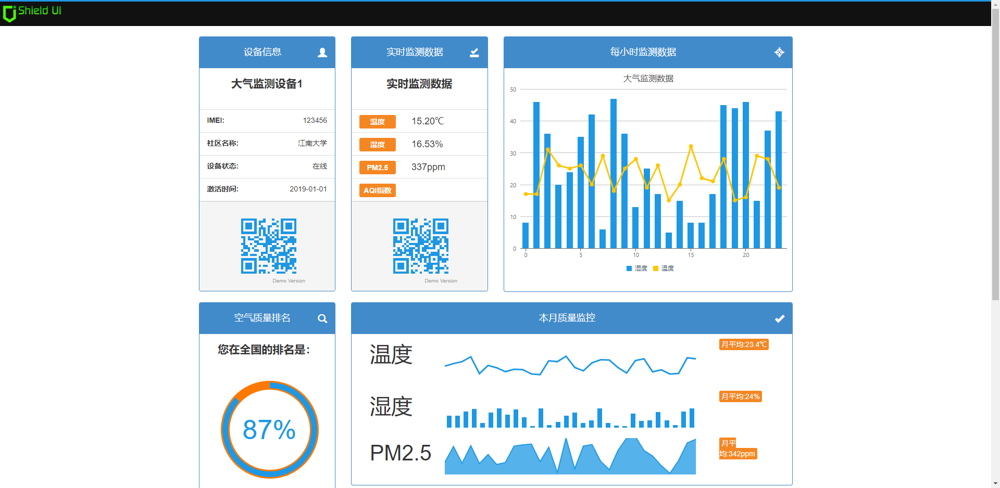

# Air Webapp

> 大气环境检测系统的WEB站点

## 技术栈

jsp + servlet + jdbc + mysql 

> 登录账号:admin 登录密码:123456

## 使用

```txt
# 1. 下载项目到本地
# git clone https://github.com/kevinten10/Air-Webapp.git

# 2. 打开项目(推荐使用IDEA)

# 3. 使用sql文件创建项目MySQL数据库 
# src\main\java\com\ten\air\constant\AirRecord.sql

# 4. 修改MySQL配置信息
# src\main\java\com\ten\air\constant\MysqlConfig.java

# 5. 配置Tomcat，启动项目

```

## DEMO


